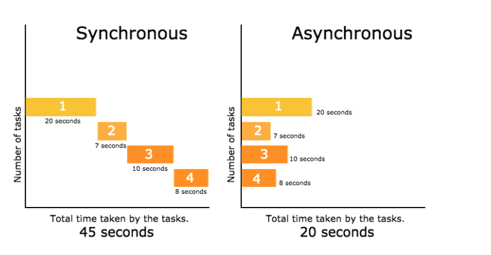
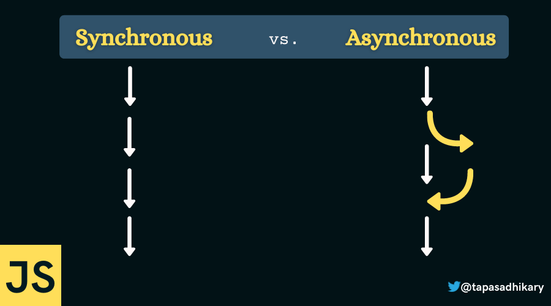

# Mavzu 2: Soket bilan ishlash
 
## Reja:
1. [Bilim](#1-bilim)
   - [1.1 Terminlar](#11-terminlar)
   - [1.2 O'qish uchun materiallar](#12-oqish-uchun-materiallar)
2. [Amaliyot. O'qituvchi](#2-amaliyot-oqituvchi)
3. [Amaliyot. O'quvchi](#3-amaliyot-oquvchi)

## 1. Bilim

### 1.1 Terminlar
```

```
### 1.2 O'qish uchun materiallar

## 2. Amaliyot. O'qituvchi

**Reja:**
- [2.1 Socket bilan ishlash]()
- [2.2 Thread - oqim]()
- [2.3 Lock - qulflab qo'yish]()
- [2.4 Sinxron va assinxron kod]()
- [2.5 Task]()
- [2.6 Selenium bilan ishlash]()
### 2.1 Soket


<br>
#### TCP va UDP


<br>

#### Handshake


1. Server va mijoz bilan socket yordamda aloqa o'rnatamiz
<br>
server
```python
import socket

HOST = "127.0.0.1"
PORT = 3000

with socket.socket(socket.AF_INET, socket.SOCK_STREAM) as server_socket:
    server_socket.bind((HOST, PORT))
    server_socket.listen()
    connection, address = server_socket.accept()
    with connection:
        print("Ulandi. Manzil: ", address)
        while True:
            data = connection.recv(1024)
            if not data:
                break
            connection.sendall(data)
```

Mijoz
```python
import socket

HOST = "127.0.0.1"
PORT = 3000

with socket.socket(socket.AF_INET, socket.SOCK_STREAM) as client_socket:
    client_socket.connect((HOST, PORT))
    client_socket.sendall(b"Server va mijoz ulandi")

    data = client_socket.recv(1024)
    print("Habar: ", repr(data))
```

2. Thread - oqim. Bitta oqim bilan ishlashni ko'ramiz

```python
import threading

def funk():
    print("Assalomu alaykum")

thread = threading.Thread(target=funk)
thread.start()
```

Natija

```text
Assalomu alaykum
```

3. Endi ko'p oqimlar bilan ishlashni ko'ramiz

```python
import threading

def funk(num):
    print(num)

thread1 = threading.Thread(target=funk, args=[1])
thread1.start()

thread2 = threading.Thread(target=funk, args=[2])
thread2.start()

thread3 = threading.Thread(target=funk, args=[3])
thread3.start()
```
Yoki
```python
import concurrent.futures


def funk(num):
    print(num)
    
with concurrent.futures.ThreadPoolExecutor(max_workers=3) as worker:
    worker.map(funk, range(1,4))
```
Natija
```text
1
2
3
```
Ya'ni funksiyani 3 marta parallel ishga tushirdik
<br>
Bu yerda bitta muammo bor (race condition). Hamma oqimdagi funksiyalar bir paytda ma'lumotni foydalanmoqchi bo'lganda muammo bo'ladi.

4. Race condition muammosini tushunib olish uchun bitta misol ko'ramiz

```python
import concurrent.futures
import time

class Database:


    def __init__(self):
        self.value = 0

    def update(self, name):
        print(f"{name} oqimi ishga tushdi")
        local_copy = self.value
        local_copy += 1
        time.sleep(0.1)
        self.value = local_copy
        print(f"{name} oqimi ishini tugatdi")

database = Database()
print(f"update funksiyasini testi boshlandi. value : {database.value}")
with concurrent.futures.ThreadPoolExecutor(max_workers=2) as worker:
    for i in range(1,3):
        worker.submit(database.update, i)

print(f"update funksiyasini testi tugadi. value : {database.value}")
```
Natija 
```text
update funksiyasini testi boshlandi. value : 0
1 oqimi ishga tushdi
2 oqimi ishga tushdi
2 oqimi ishini tugatdi
1 oqimi ishini tugatdi
update funksiyasini testi tugadi. value : 1
``` 
**Nega?**
<br>


<br>

Avval 1-oqim ishga tushadi va value = 1 bo'ladi, so'ng sleep() hisobiga kutib turadi

<br>


<br>
1-oqim kutib turgan paytda 2-oqim ishga tushadi

<br>


2-oqimda ham value=1 bo'ladi. So'ng 1-oqim natijasini value ga yozib qo'yadi
<br>

<br>
So'ng 2-oqim natijasini value ga yozib qo'yadi
<br>

<br>

Race condition muammosi yechimlaridan biri  bazani "qulflab qo'yish" bilan bo'ladi.

5. Yuqoridagi misolni ko'ramiz, faqat endi bazadagi muammoni hal qilamiz. Oldingi kodimizga 3 qator qo'shimcha qilamiz xolos

```python
import concurrent.futures
import time
import threading


class Database:

    def __init__(self):
        self.value = 0
        self._lock = threading.Lock()

    def update(self, name):
        with self._lock :
            print(f"{name} oqimi ishga tushdi")
            local_copy = self.value
            local_copy += 1
            time.sleep(0.1)
            self.value = local_copy
            print(f"{name} oqimi ishini tugatdi")

database = Database()
print(f"update funksiyasini testi boshlandi. value : {database.value}")
with concurrent.futures.ThreadPoolExecutor(max_workers=2) as worker:
    for i in range(1,3):
        worker.submit(database.update, i)

print(f"update funksiyasini testi tugadi. value : {database.value}")
```
Natija

```text
update funksiyasini testi boshlandi. value : 0
1 oqimi ishga tushdi
1 oqimi ishini tugatdi
2 oqimi ishga tushdi
2 oqimi ishini tugatdi
update funksiyasini testi tugadi. value : 2
```


### 2.4 Sinxron va assinxron kod

<br>

<br>

<br>
Misol
<br>

6. Sinxron kodga misol

```python
def non_tayyorla():
    print("non_tayyorl")

def choy_tayyorla():
    print("choy_tayyorla")

def ovqat_tayyorla():
    print("ovqat_tayyorla")

def salat_tayyorla():
    print("salat_tayyorla")

def mevalar_tayyorla():
    print("mevalar_tayyorla")


def tushlik_tayyorla():
    non_tayyorla()
    choy_tayyorla()
    ovqat_tayyorla()
    salat_tayyorla()
    mevalar_tayyorla()

tushlik_tayyorla()
```
Natija:
```text
non_tayyorl
choy_tayyorla
ovqat_tayyorla
salat_tayyorla
mevalar_tayyorla
```
7. Endi yuqoridagi misolni assinxron qilamiz, ya'ni parallel bajaramiz

```python
import asyncio

async def non_tayyorla():
    print("non_tayyorl")

async def choy_tayyorla():
    print("choy_tayyorla")

async def ovqat_tayyorla():
    print("ovqat_tayyorla")

async def salat_tayyorla():
    print("salat_tayyorla")

async def mevalar_tayyorla():
    print("mevalar_tayyorla")


async def tushlik_tayyorla():
    await non_tayyorla()
    await choy_tayyorla()
    await ovqat_tayyorla()
    await salat_tayyorla()
    await mevalar_tayyorla()

loop = asyncio.get_event_loop()
result = loop.run_until_complete(tushlik_tayyorla())
```
 Natija:
```text
non_tayyorl
choy_tayyorla
ovqat_tayyorla
salat_tayyorla
mevalar_tayyorla
```
Sodda dasturda farqi ko'rinmaydi.

### 2.5 Task
Terminlar 
```text
coorutine - async funksiya
task - async funksiyalarni  bir paytda bajarish ucun ishlatiladi
```
8. Task ishlatilishiga misol ko'ramiz

```python

import asyncio

loop = asyncio.get_event_loop()

async def habar_ber(daqiqa, habar):
    await asyncio.sleep(daqiqa)
    print(habar)

async def main():
    task1 = loop.create_task(habar_ber(2, "1-habar"))
    task2 = loop.create_task(habar_ber(1, "2-habar"))

    await task1
    await task2
result = loop.run_until_complete(main())
```

### 2.6 Selenium bilan ishlash

```commandline
pip install selenium
```
Drayverlar
- [Chrome](https://sites.google.com/chromium.org/driver/downloads?authuser=0) chrome drayverini o'rnatib olamiz
- [Firefox](https://github.com/mozilla/geckodriver/releases)

#### Selenium find_element, send_keys

9. Web sahifani title tegida Google so'zi borligini test qilamiz

```python
from selenium import webdriver
from selenium.webdriver.common.keys import Keys

driver = webdriver.Chrome()
driver.get("https://www.google.com/")
assert "Google" in driver.title
searchbar = driver.find_element(by="name", value="q")
searchbar.clear()
searchbar.send_keys("Programming")
searchbar.send_keys(Keys.RETURN)
```

#### Selenium find_element

10. Endi sahifaga kirgandan so'ng, biron havolaga kiramiz
```python
import time

from selenium import webdriver
from selenium.webdriver.common.by import By

driver = webdriver.Chrome()
driver.get("http://maxway.uz/")

burger = driver.find_element(by=By.XPATH, value='/html/body/div/div[1]/div/div/div[3]/button')
burger.click()
```
Natija
<br>

<br>
#### Selenium get_attribute

11. Veb sahifadagi nima haqida ekanligini bilib olamiz

```python
import time

from selenium import webdriver
from selenium.webdriver.common.by import By

driver = webdriver.Chrome()
driver.get("http://maxway.uz/")

burger = driver.find_element(by=By.NAME, value='description')
about = burger.get_attribute('content')
print(about)
```

#### Selenium wait

12. Browzerda element paydo bo'lishini kutish

```python
from selenium import webdriver
from selenium.webdriver.common.by import By
from selenium.webdriver.support.ui import WebDriverWait
from selenium.webdriver.support import expected_conditions as es

driver = webdriver.Firefox()
driver.maximize_window()

driver.get("http://maxway.uz/")

try:
    element = WebDriverWait(driver, 100).until(es.presence_of_element_located((By.XPATH, "/html/body/div/div[5]/div/div/div/div/div[3]/div/div[2]/div[2]/button")))
    print("Element paydo bo'ldi")
    WebDriverWait(driver, 5)
except Exception as e:
    print(e)
finally:
    driver.quit()
```

13. O'yin o'ynaymiz

```python
import random
import time

from selenium import webdriver
from selenium.webdriver.common.keys import Keys
from selenium.webdriver.common.by import By
driver = webdriver.Chrome()
driver.get("https://www.google.com/")
assert "Google" in driver.title
searchbar = driver.find_element(by="name", value="q")
searchbar.clear()
searchbar.send_keys("Pacman")
searchbar.send_keys(Keys.RETURN)
driver.find_element(by=By.XPATH, value='(//h3)[1]/../../a').click()

moves = [Keys.LEFT, Keys.RIGHT, Keys.UP,Keys.DOWN]
while True:
    driver.find_element(by=By.CSS_SELECTOR, value="iframe").send_keys(random.choice(moves))
```

Qo'shimcha ma'lumotlar uchun [webdriver API](https://selenium-python.readthedocs.io/)


### 3. Amaliyot. O'quvchi
Yuqoridagi kutubhonalardan foydalanib o'zingiz ijod qilib bittadan dastur yozing
