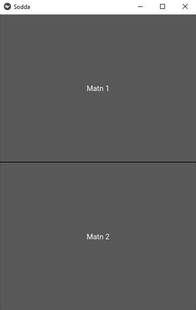

# Mavzu 3: Kivy da mobil dastur yozish
 
## Reja:
1. [Bilim](#1-bilim)
   - [1.1 Terminlar](#11-terminlar)
   - [1.2 O'qish uchun materiallar](#12-oqish-uchun-materiallar)
2. [Amaliyot. O'qituvchi](#2-amaliyot-oqituvchi)
3. [Amaliyot. O'quvchi](#3-amaliyot-oquvchi)

## 1. Bilim

### 1.1 Terminlar
```

```
### 1.2 O'qish uchun materiallar

## 2. Amaliyot. O'qituvchi
- [2.1 Kivyga kirish]
   - [2.1.1 Kivyni o'rnatish]
   - [2.1.2 Kivyda sodda dastur]
   - [2.1.3 KV fayl strukturasi]
- [2.2 Molashuvchan interfeys]
    - [2.2.1 BoxLayout]
    - [2.2.1 AnchorLayout]    
     
   - [DP: Density-independent Pixels]

**Reja:**

#### 2.1 Kivyga kirish
#### 2.1.1 Kivyni o'rnatish

```commandline
pip install kivy[base]
```
To'liq versiyasi
```commandline
pip install kivy[full]
```

**Kivy** - bu mobil qurilmalarga dastur yozish uchun kutubhonadir. Kv - bu dizaynni yasash uchun ishlatiladigan html ga o'xashash format
<br>
Ijobiy tarafi:
- Bitta kod bilan android va iPhone ga dastur tuzish mumkin

Salbiy tarafi:
- Dizayn o'zinikidaka bo'lmaydi
- Nativ til emas
- Hujjat yetarli emas
- Qo'llab quvvatlash jamiyati yetarli emas

#### 2.1.2 Kivyda sodda dastur

1. Kivy da eng sodda dastur yozing

```python
from kivy.app import App

class SoddaApp(App):
    pass

app = SoddaApp()
app.run()

```

Natija
<br>


### 2.1.3 KV fayl strukturasi

2. Kivyda interfeys yasaymiz. Buning uchun sodda.kv nomli fayl yaratamiz

sodda.kv

``` text
MainWidget:


```

```python
from kivy.app import App
from kivy.uix.widget import Widget

class MainWidget(Widget):
    pass

class SoddaApp(App):
    pass

app = SoddaApp()
app.run()
```

Natija
<br>


3. Kv faylga tugma qo'shamiz

sodda.kv
   
```text
MainWidget:

<MainWidget>:
    Button:
        text: "kivy dastur"
```

main.py

```python
from kivy.app import App
from kivy.uix.widget import Widget

class MainWidget(Widget):
    pass

class SoddaApp(App):
    pass

app = SoddaApp()
app.run()
```

Natija
<br>


4. Tugma o'lchami va pozitsiyasini o'zgartiramiz

sodda.kv
```text
MainWidget:

<MainWidget>:
    Button:
        text: "kivy dastur"
        pos: 100, 200
        size: 300, 100
```

Natija
<br>


5. px hamma ekranlarda har hil bo'ladi, natijada tugma telefonda boshqa, planshetda boshqa o'lcham bo'lishi mumkin. Shuning uhcun endi hammasida bir hil bo'lishi uchun dp o'lcham birligidan foydalanamiz

```text
MainWidget:

<MainWidget>:
    Button:
        text: "kivy dastur"
        pos: "100dp", "200dp"
        size: "300dp", "100dp"
```

Natija
<br>


6. Ikkinchi tugmani qo'shamiz

```text
MainWidget:

<MainWidget>:
    Button:
        text: "kivy dastur"
        pos: "100dp", "200dp"
        size: "300dp", "100dp"

    Button:
        text: "kivy"
        pos: "100dp", "400dp"
        size: "300dp", "100dp"
```

Natija
<br>


7. Endi yozuv (label) qo'shamiz

```text
MainWidget:

<MainWidget>:
    Button:
        text: "kivy dastur"
        pos: "100dp", "200dp"
        size: "300dp", "100dp"
    Button:
        text: "kivy"
        pos: "100dp", "400dp"
        size: "300dp", "100dp"
    Label:
        text: "label"
        pos: "100dp", "0dp"
        size: "300dp", "100dp"
        color: 1, 0 , 0, 1
```

Natija
<br>


### 2.2 Molashuvchan interfeys
#### 2.2.1 BoxLayout


Layout turlari


Dastur interfeysi wijet yoki layout bo'ladi

<br>

8. BoxLayout ga misol

```python
from kivy.app import App
from kivy.uix.button import Button
from kivy.uix.widget import Widget
from kivy.uix.boxlayout import BoxLayout


class BoxLayoutMisol(BoxLayout):

    def __init__(self, **kwargs):
        super().__init__(**kwargs)
        self.orientation = "horizontal"
        b1 = Button(text="Matn 1")
        b2 = Button(text="Matn 2")
        self.add_widget(b1)
        self.add_widget(b2)

class MainWidget(Widget):
    pass

class SoddaApp(App):
    pass

app = SoddaApp()
app.run()

```

sodda.kv 
```text
BoxLayoutMisol:

<MainWidget>:
    Button:
        text: "kivy dastur"
        pos: "100dp", "200dp"
        size: "300dp", "100dp"
    Button:
        text: "kivy"
        pos: "100dp", "400dp"
        size: "300dp", "100dp"
    Label:
        text: "label"
        pos: "100dp", "0dp"
        size: "300dp", "100dp"
        color: 1, 0 , 0, 1
```

Natija
<br>


9. Yuqoridagi misolni kv fayl bilan yasaymiz

```python
from kivy.app import App
from kivy.uix.button import Button
from kivy.uix.widget import Widget
from kivy.uix.boxlayout import BoxLayout


class BoxLayoutMisol(BoxLayout):
    pass

class MainWidget(Widget):
    pass

class SoddaApp(App):
    pass

app = SoddaApp()
app.run()
```

kv.fayl

```text
BoxLayoutMisol:

<BoxLayoutMisol>:
    orientation: vertical
    Button:
        text: "Matn 1"
    Button:
        text: "Matn 2"       
        
<MainWidget>:
    Button:
        text: "kivy dastur"
        pos: "100dp", "200dp"
        size: "300dp", "100dp"
    Button:
        text: "kivy"
        pos: "100dp", "400dp"
        size: "300dp", "100dp"
    Label:
        text: "label"
        pos: "100dp", "0dp"
        size: "300dp", "100dp"
        color: 1, 0 , 0, 1
```

Natija
<br>


Layout o'lcham va pozitsiyalarni o'zi boshqaradi. Shuning uchun ularni yozganda foydasi bo'lmaydi
10. kv faylda layoutda o'lchamlar bilan ishlash

```text
size_hint: 0.5, 0.5
```

10. kv faylda layoutda o'lchamlar bilan ishlash

```text
#size: "100dp", "100dp"
size_hint: None, None
```
11. Bo'yi, enini alohida berish

```text
    #size: "100dp", "100dp"
    size_hint: None, None
    width: "100dp"
    height: "100dp"
```

12. Bo'yini foizda, enini sonda berish

```text
    #size: "100dp", "100dp"
    size_hint: 0.5, None
    #width: "100dp"
    height: "100dp"
```

13. Gorizontal pozitsiyasini o'zgartirish
- Gorizontal hususiyatlar: x, center_x, right
- Vertikal hususiyatlar: y, center_y, bottom

```text
    #size: "100dp", "100dp"
    size_hint: 0.5, None
    #width: "100dp"
    height: "100dp"
    pos_hint: {"x": 0.5}   
```

14. Vertikal pozitsiyasini o'zgartirish
- Gorizontal hususiyatlar: x, center_x, right
- Vertikal hususiyatlar: y, center_y, left

```text
    #size: "100dp", "100dp"
    size_hint: .5, .5
    #width: "100dp"
    #height: "100dp"
    pos_hint: {"center_y": .5}   
```

15. Layout ichida Layout ishlatish

```text
BoxLayoutMisol:

<BoxLayoutMisol>:
    orientation: "vertical"
    Button:
        text: "Matn 1"
    BoxLayout:
        orientation: "horizontal"
        Button:
            text: "Matn 21"
        Button:
            text: "Matn 22"
        Button:
            text: "Matn 23"
    Button:
        text: "Matn 3"


```

Natija
<br>


16. Layout orasida masofa qoldirish

```text
BoxLayoutMisol:

<BoxLayoutMisol>:
    orientation: "vertical"
    Button:
        text: "Matn 1"
    BoxLayout:
        orientation: "horizontal"
        spacing: "5dp"
        Button:
            text: "Matn 21"
        Button:
            text: "Matn 22"
        Button:
            text: "Matn 23"
    Button:
        text: "Matn 3"


```

Natija
<br>


#### 2.2.2 AnchorLayout

17. AnchorLayout ga misol

sodda.kv
```text
AnchorLayoutMisol:

<AnchorLayoutMisol>:
    Button:
        text: "AnchorLayout"

```
```python
from kivy.app import App
from kivy.uix.anchorlayout import AnchorLayout
from kivy.uix.button import Button
from kivy.uix.widget import Widget
from kivy.uix.boxlayout import BoxLayout


class AnchorLayoutMisol(AnchorLayout):
    pass

class BoxLayoutMisol(BoxLayout):
    pass

class MainWidget(Widget):
    pass

class SoddaApp(App):
    pass

app = SoddaApp()
app.run()

```

Natija
<br>


18. AnchorLayout da o'lchamni o'zgartiramiz

```text
AnchorLayoutMisol:

<AnchorLayoutMisol>:
    Button:
        text: "AnchorLayout"
        size_hint: .2,.1

```

Natija
<br>


19. AnchorLayout da pozitsiya
```text
AnchorLayoutMisol:

<AnchorLayoutMisol>:
    #right, left,center
    anchor_x: "right"
    #bottom, top, center
    anchor_y: "top"
    Button:
        text: "AnchorLayout"
        size_hint: .2,.1

```

Natija
<br>


20. Anchorga boshqa misol

```text
AnchorWindow:

<AnchorWindow>:
    anchor_x: "right"
    Button:
        text: "main app"
        size_hint: None, None
        width: "100dp"
        height: "200dp"
        color: "red"
        background_color: "blue"
        on_press: print("ouch! More gently please")
```

Natija
<br>


21. AnchorLayout ichida BoxLayout

```text
AnchorWindow:

<AnchorWindow>:
    anchor_x: "right"
    anchor_y: "top"
    BoxLayout:
        size_hint: None, None
        width: "400dp"
        height: "200dp"
        Button:
            text: "button1"
        Button:
            text: "button2"
```

Natija
<br>


#### 2.2.3 GridLayout


22. GridLayout ga misol

```text
GridLayoutWindow:

<GridLayoutWindow@GridLayout>:
    cols: 4
    Button:
        text: "A"
    Button:
        text: "B"
    Button:
        text: "C"
    Button:
        text: "D"
    Button:
        text: "E"
    Button:
        text: "F"
```

Natija
<br>


23. GridLayout: rows

```text
GridLayoutWindow:

<GridLayoutWindow@GridLayout>:
    rows: 3
    Button:
        text: "A"
    Button:
        text: "B"
    Button:
        text: "C"
    Button:
        text: "D"
    Button:
        text: "E"
    Button:
        text: "F"
```

Natija
<br>


23. GridLayout usuni enini o'zgartirish

```text
GridLayoutWindow:

<GridLayoutWindow@GridLayout>:
    rows: 3
    Button:
        text: "A"
        size_hint: .5, 1
    Button:
        text: "B"
    Button:
        text: "C"
        size_hint: .5, 1
    Button:
        text: "D"
    Button:
        text: "E"
        size_hint: .5, 1
    Button:
        text: "F"
```

Natija
<br>


24. GridLayout qator bo'yini o'zgartirish

```text
GridLayoutWindow:

<GridLayoutWindow@GridLayout>:
    rows: 3
    Button:
        text: "A"
        size_hint: .5, 0.5
    Button:
        text: "B"
        size_hint: 1, 0.5
    Button:
        text: "C"
        size_hint: .5, 1
    Button:
        text: "D"
    Button:
        text: "E"
        size_hint: .5, 1
    Button:
        text: "F"
```

Natija
<br>


25. GridLayout ichida mavjud bo'lgan BoxLayout ni joylashtirish

```text
GridLayoutWindow:

<GridLayoutWindow@GridLayout>:
    rows: 3
    Button:
        text: "A"
        size_hint: .5, 0.5
    Button:
        text: "B"
        size_hint: 1, 0.5
    Button:
        text: "C"
        size_hint: .5, 1
    BoxLayoutWidget:
    Button:
        text: "E"
        size_hint: .5, 1
    Button:
        text: "F"

```

Natija
<br>


#### 2.2.4 StackLayout

Har bir elementni o'lchamini berish mumkin. BaxLayoutdan farqli elementlar bir qancha qatorda joylashadi

26. StackLayout ga misol

```text
StackLayoutWindow:


<StackLayoutWindow>:
    Button:
        text: "A"
        size_hint: 0.5,0.2
    Button:
        text: "B"
        size_hint: 0.5,0.2
    Button:
        text: "C"
        size_hint: 0.2,0.2
    Button:
        text: "D"
        size_hint: 0.2,0.2
    Button:
        text: "E"
        size_hint: 0.2,0.2
```

Natija
<br>


27. python fayldan qo'shish

```python
from kivy.app import App
from kivy.uix.button import Button
from kivy.uix.stacklayout import StackLayout

class StackLayoutWindow(StackLayout):
    def __init__(self, **kwargs):
        super().__init__(**kwargs)
        for i in range(1, 10):
            b = Button(text=str(i), size_hint=(.2, .2))
            self.add_widget(b)

class MainApp(App):
    pass

MainApp().run()
```


Natija
<br>


28. Aniq o'lchamli tugmalarni qo'shamiz:


```python
from kivy.app import App
from kivy.metrics import dp
from kivy.uix.button import Button
from kivy.uix.stacklayout import StackLayout


class StackLayoutWindow(StackLayout):
    def __init__(self, **kwargs):
        super().__init__(**kwargs)
        for i in range(1, 10):
            b = Button(text=str(i), size_hint=(None, None), size=(dp(100), dp(100)))
            self.add_widget(b)


class MainApp(App):
    pass

MainApp().run()
```

Natija
<br>


 29. StackLayout da orientatsiya: quyidagicha bo'ladi 
<br>
     Terminlar:
- l - left
- r - right
- b - bottom
- t - top
  orientation:
- "lr-tb" 
- "rl-tb"
- "lr-bt"
- "rl-bt"

30. orientation

```python
from kivy.app import App
from kivy.metrics import dp
from kivy.uix.button import Button
from kivy.uix.stacklayout import StackLayout


class StackLayoutWindow(StackLayout):
    def __init__(self, **kwargs):
        self.orientation = "rl-bt"
        super().__init__(**kwargs)
        for i in range(1, 10):
            b = Button(text=str(i), size_hint=(None, None), size=(dp(100), dp(100)))
            self.add_widget(b)

class MainApp(App):
    pass

MainApp().run()
```

Natija
<br>


31. padding. 4ta qiymatdan iborat: left, top, right, bottom

```python
from kivy.app import App
from kivy.metrics import dp
from kivy.uix.button import Button
from kivy.uix.stacklayout import StackLayout


class StackLayoutWindow(StackLayout):
    def __init__(self, **kwargs):
        self.orientation = "rl-bt"
        self.padding = (dp(20), dp(20), dp(20), dp(20))
        super().__init__(**kwargs)
        for i in range(1, 10):
            b = Button(text=str(i), size_hint=(None, None), size=(dp(100), dp(100)))
            self.add_widget(b)

class MainApp(App):
    pass

MainApp().run()
```

Natija
<br>


32. spacing. 2ta qiymatdan iborat: horizontal, vertical

```python
from kivy.app import App
from kivy.metrics import dp
from kivy.uix.button import Button
from kivy.uix.stacklayout import StackLayout


class StackLayoutWindow(StackLayout):
    def __init__(self, **kwargs):
        self.orientation = "rl-bt"
        self.padding = (dp(20), dp(20), dp(20), dp(20))
        self.spacing = (dp(10), dp(20))
        super().__init__(**kwargs)
        for i in range(1, 10):
            b = Button(text=str(i), size_hint=(None, None), size=(dp(100), dp(100)))
            self.add_widget(b)

class MainApp(App):
    pass

MainApp().run()
```

Natija
<br>


33. 100ta tugma qo'shing

```python
from kivy.app import App
from kivy.metrics import dp
from kivy.uix.button import Button
from kivy.uix.stacklayout import StackLayout


class StackLayoutWindow(StackLayout):
    def __init__(self, **kwargs):
        self.orientation = "rl-bt"
        self.padding = (dp(20), dp(20), dp(20), dp(20))
        self.spacing = (dp(10), dp(20))
        super().__init__(**kwargs)
        for i in range(1, 100):
            b = Button(text=str(i), size_hint=(None, None), size=(dp(100), dp(100)))
            self.add_widget(b)

class MainApp(App):
    pass

MainApp().run()
```

Natija
<br>


Lekin 100 tugmaning hammasi ko'rinmaydi, shuning uchun ScrollView dan foydalanamiz

#### 2.2.6 ScrollView 
Scroll ishlash uchun biz size_hint orqali o'lchamlarini berishimiz kerak

34. 100 tugmani ko'rinadigan qilib qo'shing

```text
ScrollViewWindow:

<ScrollViewWindow@ScrollView>
    StackLayoutWindow:
        size_hint: 1, None
        height: 4000

<StackLayoutWindow>:

```

Natija
<br>


35. Balandlikni oyna o'lchamiga qarab moslashadigan(o'zgaradigan) qilish

```text
ScrollViewWindow:

<ScrollViewWindow@ScrollView>
    StackLayoutWindow:
        size_hint: 1, None
        height: self.minimum_height

<StackLayoutWindow>:
```

Natija
<br>


#### 2.2.7 PageLayout

36. PageLayout ga yuqoridagi hamma oynalarni joylashtiring
```text
PageLayoutWindow:

<PageLayoutWindow@PageLayout>:
    MainWidget:
    ScrollViewWindow:
    StackLayoutWindow:
    GridLayoutWindow:
    AnchorWindow:
    BoxLayoutWidget:
    MainWidget:
```

Natija
<br>


 
[Layout haqida ma'lumot](https://kivy.org/doc/stable/gettingstarted/layouts.html)

### Widgets
#### Button

37. Gridlayoutga Button qo'shamiz

```text
WidgetsWindow:

<WidgetsWindow@GridLayout>:
    cols: 3
    Button:
        text: "A"
    Button:
        text: "B"
```

Natija
<br>


38. Endi tugmani bosganda boshqa funksiyani ishga tushirsin

```text
WidgetsWindow:

<WidgetsWindow>:
    cols: 3
    Button:
        text: "A"
        on_press: root.on_pressed()
    Button:
        text: "B"

```

```python
from kivy.uix.gridlayout import GridLayout

class WidgetsWindow(GridLayout):
    def on_pressed(self):
        print("pressed")

# ...
```

Natija
<br>


39. Tugma bosilgan ikkinchi tugma matni o'zgarsin

```python
from kivy.app import App
from kivy.metrics import dp
from kivy.properties import StringProperty
from kivy.uix.gridlayout import GridLayout

class WidgetsWindow(GridLayout):
    my_text = StringProperty("Matn")

    def on_pressed(self):
        print("pressed")
        self.my_text = "Tugmani bosdingiz"
```

```text
WidgetsWindow:

<WidgetsWindow>:
    cols: 3
    Button:
        text: "A"
        on_press: root.on_pressed()
    Button:
        text: root.my_text
```

Natija
<br>


#### ToggleButton

### 3. Amaliyot. O'quvchi
Yuqoridagi kutubhonalardan foydalanib o'zingiz ijod qilib dastur yozing
