# Mavzu 4: Kivy. Widget 
 
## Reja:
1. [Bilim](#1-bilim)
   - [1.1 Terminlar](#11-terminlar)
   - [1.2 O'qish uchun materiallar](#12-oqish-uchun-materiallar)
2. [Amaliyot. O'qituvchi](#2-amaliyot-oqituvchi)
3. [Amaliyot. O'quvchi](#3-amaliyot-oquvchi)

## 1. Bilim

### 1.1 Terminlar
```
disabled - ishlamaydigan qilish
```
### 1.2 O'qish uchun materiallar

## 2. Amaliyot. O'qituvchi
- [2.1 StringProperty](#21_stringproperty)
- [2.2 Disabled hususiyati](#22_disabled_hususiyati)
- [2.3 Switch widget](#23_switch_widget)
- [2.4 Slider widget](#24_slider_widget)
- [2.5 ProgressBar widget](#25_progressbar_widget)
- [2.6 TextInput Widget](#26_textInput_widget)
- [2.7 Image widget](#27_image_widget)


### 2.1 StringProperty

1. Toggle tugma holatiga qarab sonni birga oshirib borish. Agar toggle  tugma ON bo'lsa, son birga o'shsin, aks holda o'zgarmasin

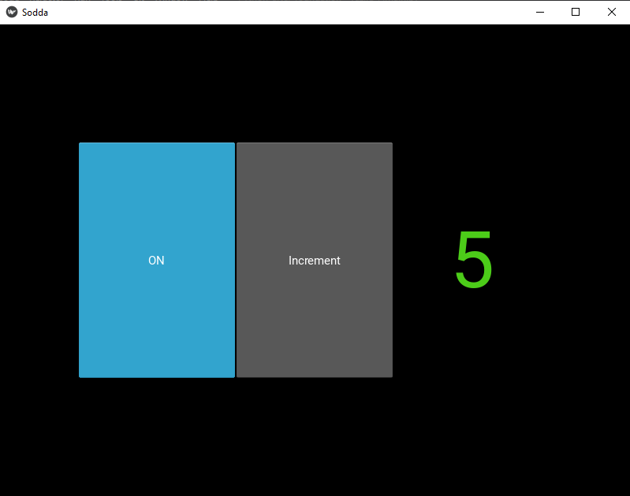

[kv fayl](Sinf%20ishi/vazifa%201/sodda.kv)

[Python fayl](Sinf%20ishi/vazifa%201/main.py)

#### 2.2 Disabled hususiyati

2. Tugmani ishlamaydigan qilish


[kv fayl](Sinf%20ishi/vazifa%202/sodda.kv)

[Python fayl](Sinf%20ishi/vazifa%202/main.py)

### 2.3 Switch widget

3. Toggle button o'rniga Switch ishlatamiz

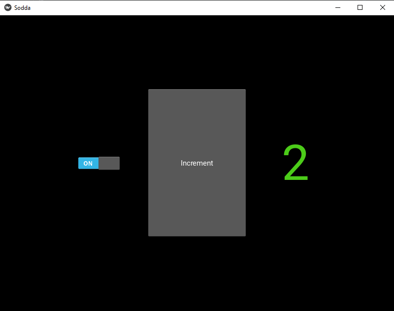

[kv fayl](Sinf%20ishi/vazifa%203/sodda.kv)

[Python fayl](Sinf%20ishi/vazifa%203/main.py)

### 2.4 Slider widget

4. Sliderga misol

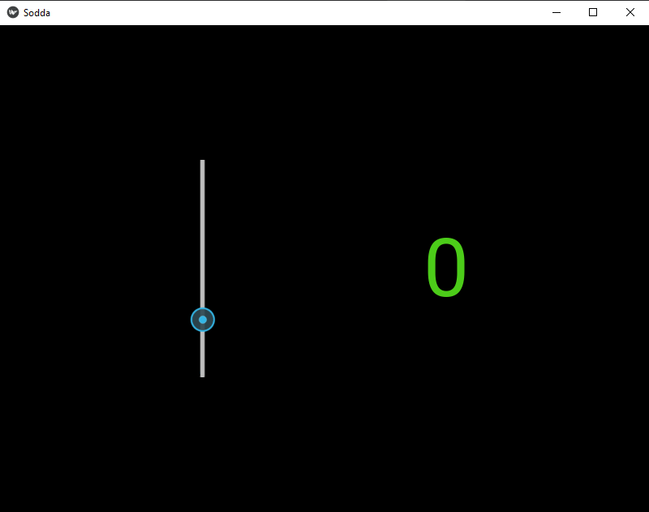

[kv fayl](Sinf%20ishi/vazifa%204/sodda.kv)

[Python fayl](Sinf%20ishi/vazifa%204/main.py)

5. Slider.value nechchi bo'lsa, uni label da ko'rsating

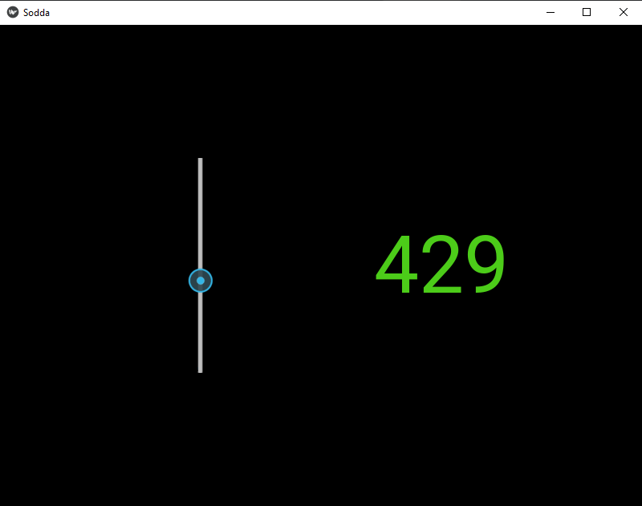

[kv fayl](Sinf%20ishi/vazifa%205/sodda.kv)

[Python fayl](Sinf%20ishi/vazifa%205/main.py)

#### id

6. 5-mashqni kv faylning o'zida **id** orqali amalga oshiramiz

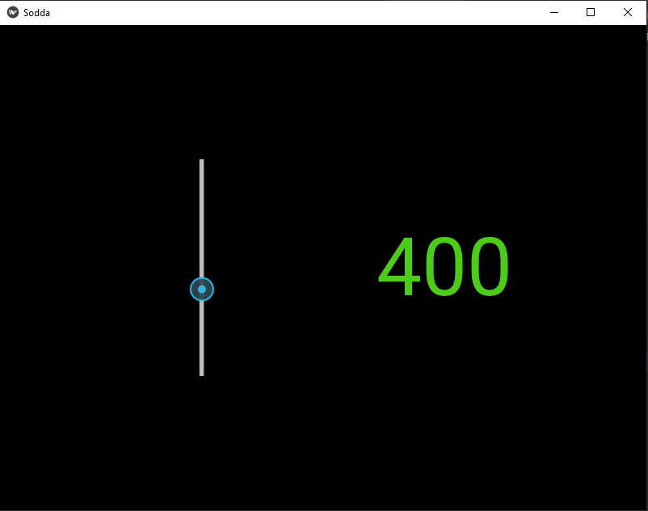

[kv fayl](Sinf%20ishi/vazifa%206/sodda.kv)

[Python fayl](Sinf%20ishi/vazifa%206/main.py)

7. 6-mashqa switch qo'shamiz, so'ng kv faylning o'zida id yordamida switch off bo'lsa, slider ishlamasin, on bo'lsa ishlasin

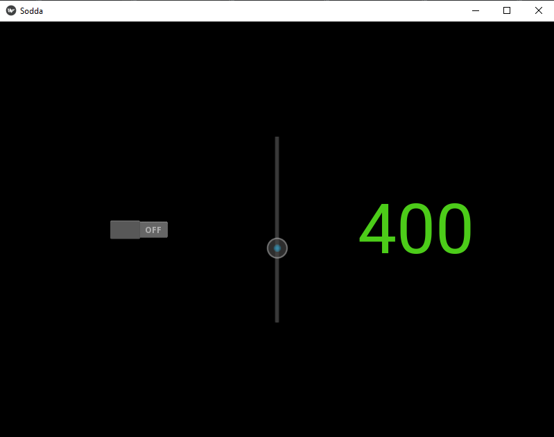

[kv fayl](Sinf%20ishi/vazifa%207/sodda.kv)

[Python fayl](Sinf%20ishi/vazifa%207/main.py)

### 2.5 ProgressBar widget

8. ProgressBarga misol

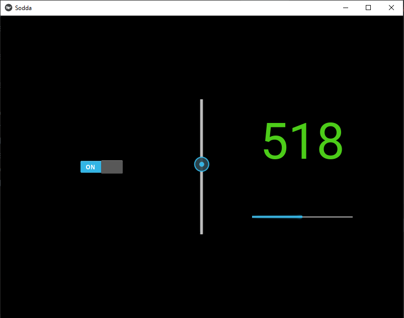

[kv fayl](Sinf%20ishi/vazifa%208/sodda.kv)

[Python fayl](Sinf%20ishi/vazifa%208/main.py)

9. Sliderni surganda ProgressBar mos ravishda o'zgarsin

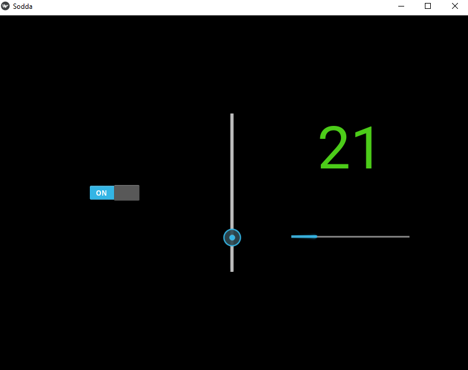

[kv fayl](Sinf%20ishi/vazifa%209/sodda.kv)

[Python fayl](Sinf%20ishi/vazifa%209/main.py)

### 2.6 TextInput Widget

10. GridLayoutdagi switch ni BoxLayout ga olamiz, va TextInput bilan Label qo'shamiz. So'ng labelda textinputga yozilgan matnni chiqaramiz

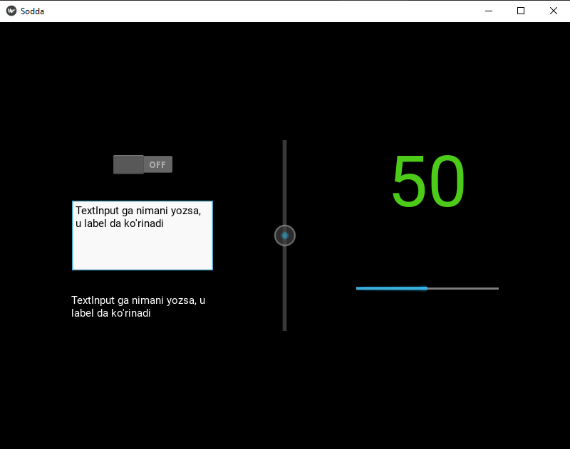

[kv fayl](Sinf%20ishi/vazifa%2010/sodda.kv)

[Python fayl](Sinf%20ishi/vazifa%2010/main.py)

11. Enter ni bosganda matnni qayta ishlash

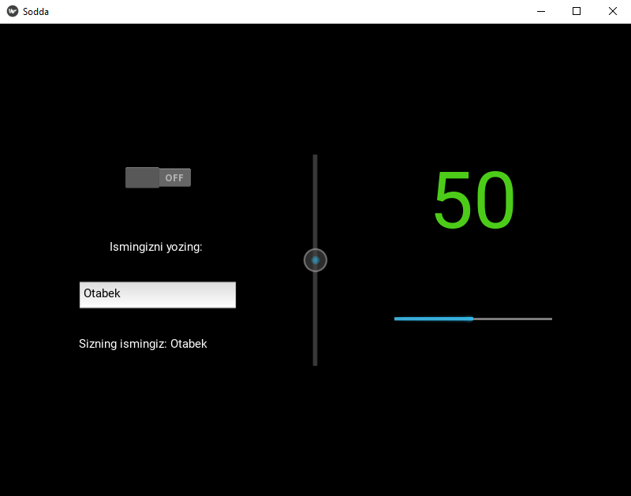

[kv fayl](Sinf%20ishi/vazifa%2011/sodda.kv)

[Python fayl](Sinf%20ishi/vazifa%2011/main.py)

### 2.7 Image widget

12. Image ga misol

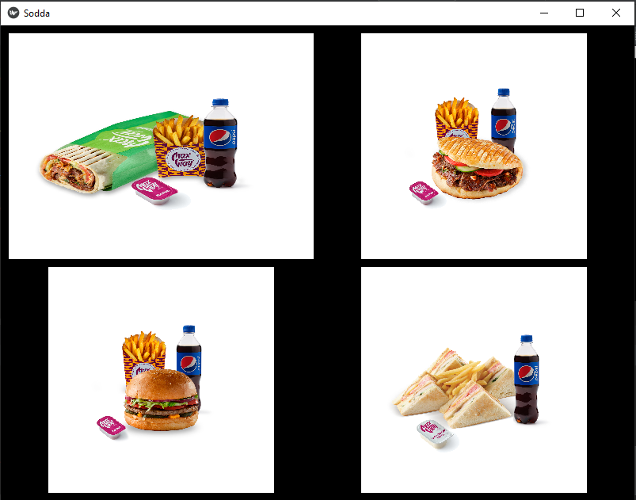

[kv fayl](Sinf%20ishi/vazifa%2012/sodda.kv)

[Python fayl](Sinf%20ishi/vazifa%2012/main.py)

