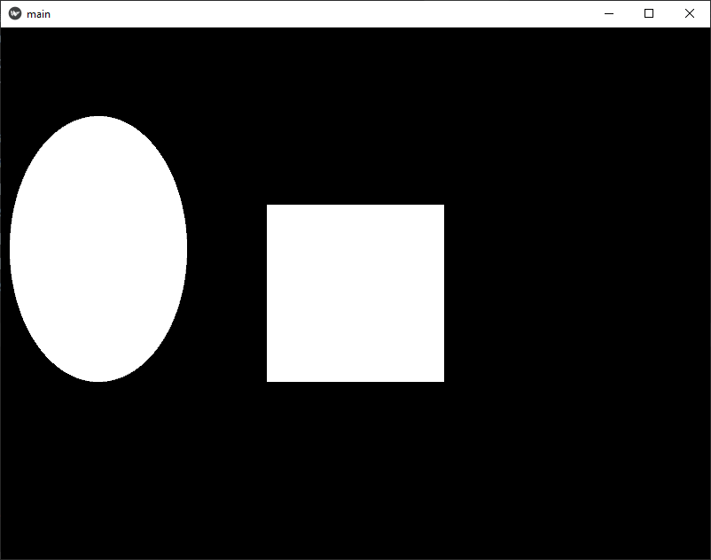
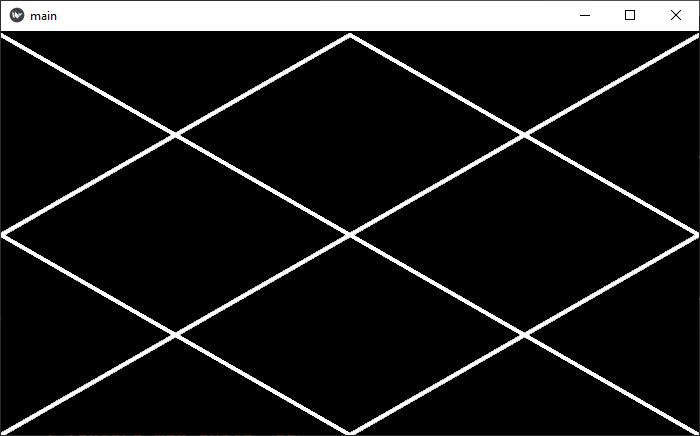

# Mavzu 5: Kivy. Canvas
 
## Reja:
1. [Bilim](#1-bilim)
   - [1.1 Terminlar](#11-terminlar)
   - [1.2 O'qish uchun materiallar](#12-oqish-uchun-materiallar)
2. [Amaliyot. O'qituvchi](#2-amaliyot-oqituvchi)
3. [Amaliyot. O'quvchi](#3-amaliyot-oquvchi)

## 1. Bilim

### 1.1 Terminlar
```

```
### 1.2 O'qish uchun materiallar

## 2. Amaliyot. O'qituvchi


### 2.1 Rectangle

1. Canvas yordamida Rectangle chizish


[kv fayl](sinf%20ishi/vazifa%201/main.kv)

[Python fayl](sinf%20ishi/vazifa%201/main.py)

2. Rectangle ga pozitsiya, eni ba bo'yiga qiymat beramiz


[kv fayl](sinf%20ishi/vazifa%202/main.kv)

[Python fayl](sinf%20ishi/vazifa%202/main.py)

3. Endi KV faylda o'zgaruvchilar bilan ishlashni o'rganamiz. So'ng to'rtburchakni o'rtaga joylashtiramiz


[kv fayl](sinf%20ishi/vazifa%203/main.kv)

[Python fayl](sinf%20ishi/vazifa%203/main.py)

### 2.2 Ellipse

4. Ellipse



[kv fayl](sinf%20ishi/vazifa%204/main.kv)

[Python fayl](sinf%20ishi/vazifa%204/main.py)

### 2.3 Line: points

5. Line. points(x1,y1,x2,y2,x3,y3 ..)


[kv fayl](sinf%20ishi/vazifa%205/main.kv)

[Python fayl](sinf%20ishi/vazifa%205/main.py)

#### Vazifa

1. Line yordamida Quyidagi shaklni chizing


6. Line yordamida prujina chizamiz


[kv fayl](sinf%20ishi/vazifa%206/main.kv)

[Python fayl](sinf%20ishi/vazifa%206/main.py)

#### Vazifa

2. Quyidahi shaklni chizing 


3. Prujinani bir necha marta chiqib quyidagini hosil qiling. O'zgaruvchilardan foydalanamiz



##### Ko'rsatma: 

1. Pastki chiziqni chizib olasmi. (Masalan ybottom = 0, ytop = 100 deb olamiz)


2. Pastki chiziqni ko'chirib olamiz, keyin har bir y ni 100dp ga tepaga suramiz, ya'ni masofa1 = 100 o'zgaruvchi e'lon qilamiz. masofa1 o'zgaruvchisini ikkinchi chiqizdagi har bir y ga qo'shib chiqamiz


3. Endi har bir x ni self.width/4 ga chapga suramiz, ya'ni har bir x dan self.width/4 ni ayiramiz. O'zgaruvchisiz amalga oshiramiz


4. Ohirgi qismini davom ettirib qo'yamiz


5. Endi hosil bo'lgan ikkita chiziqdan nusha (copy) olamiz. So'ng har bir y ni tepaga 200dp ga suramiz, ya'ni masofa2=200 o'zgaruvchini e'lon qilib, nusha olingan ikki chiziqdagi har biy y ga masofa2 ni qo'shib chiqamiz
   


6. Demak hosil bo'lgan o'zgaruvchilar:
- ytop = 200dp
- ybottom = 0
- masofa1 = 100
- masofa2 = 200
  
Endi y_top, y_bottom, masofa1, masofa2 o'zgaruvchilariga har hil qiymat berib har shakl paydo bo'lishini ko'ring. Masalan ytop=200 bersangiz quyidagi shakl paydo bo'ladi


### 2.4 Line: circle, ellipse, rectangle

7. Line: 
- circele(x, y, radius)
- ellipse(x, y, width, height)
- rectangle(x, y, width, height)


[kv fayl](sinf%20ishi/vazifa%207/main.kv)

[Python fayl](sinf%20ishi/vazifa%207/main.py)

#### Vazifa

4. 7-mashqni davom ettirib, ozgina o'zgartirish kiriting, natijada quyidagi shakl paydo bo'lsin


8. Rang berish


[kv fayl](sinf%20ishi/vazifa%208/main.kv)

[Python fayl](sinf%20ishi/vazifa%208/main.py)

9. Chiziqlar bilan birga shakllarga ham rang beramiz


[kv fayl](sinf%20ishi/vazifa%209/main.kv)

[Python fayl](sinf%20ishi/vazifa%209/main.py)

10. Shakllarni kod orqali hosil qilish


[kv fayl](sinf%20ishi/vazifa%2010/main.kv)

[Python fayl](sinf%20ishi/vazifa%2010/main.py)

11. Shakllarni qimirlatish. Tugma qo'shamiz, so'ng har gal bosganda shakl koordinatasini o'zgartiramiz


[kv fayl](sinf%20ishi/vazifa%2011/main.kv)

[Python fayl](sinf%20ishi/vazifa%2011/main.py)

12. To'rtburchak ekrandan tashqariga chiqmasligini ta'minlash


[kv fayl](sinf%20ishi/vazifa%2012/main.kv)

[Python fayl](sinf%20ishi/vazifa%2012/main.py)

#### Vazifa 
5. 4 ta tugma hosil qiling. Ularning funksiyasi bironta shaklni chapga, o'nga, tepaga, pastga surish bo'lsin. Ekrandan tashqariga chiqib ketmasligi kerak


13. Davomiy qimirlatish


[kv fayl](sinf%20ishi/vazifa%2013/main.kv)

[Python fayl](sinf%20ishi/vazifa%2013/main.py)

#### Vazifa 

6. To'rtburchakni to'rtta tarafga ekran oxirigacha to'xtamasdan qimirlaydigan qiling

14. Gorizontal yo'nalishda o'ngga va chapga borib keladigan qilish
    


[kv fayl](sinf%20ishi/vazifa%2014/main.kv)

[Python fayl](sinf%20ishi/vazifa%2014/main.py)

#### Vazifa 

7. 14-mashqni davom ettirib,dumaloq shaklni vertikal borib keladigan qiling
8. Shaklni x va y koordinatsiga qiymat berib, tunmay aylanadigan dastur yozing


