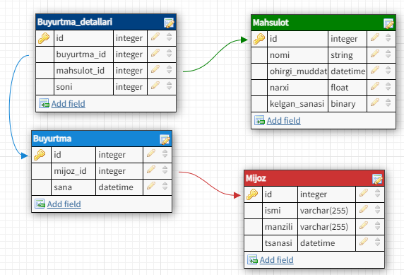

# Mavzu 6: Kivy. SQLite
 
## Reja:
1. [Bilim](#1-bilim)
   - [1.1 Terminlar](#11-terminlar)
   - [1.2 O'qish uchun materiallar](#12-oqish-uchun-materiallar)
2. [Amaliyot. O'qituvchi](#2-amaliyot-oqituvchi)
3. [Amaliyot. O'quvchi](#3-amaliyot-oquvchi)

## 1. Bilim

### 1.1 Terminlar
```

```
### 1.2 O'qish uchun materiallar

## 2. Amaliyot. O'qituvchi


### 2.1 Rectangle
Baza sxemasi: <br>



<br>
Yuqorida elektron do'konning sodda ma'lumotlar bazasi strukturasidir. Biz shu struktura bo'yicha  CREATE, INSERT, SELECT, UPDATE, DELETE amallarini [avvalgi darslarda](https://github.com/Oybeklinux/Foundation_exercices/tree/main/24.%20SQLite.%20CRUD) o'rgangan edik. 
Endi esa ularni python orqali amalga ochiramiz, ya'ni klasslar yozib, ular orqali CRUD (C - kiritish, R - o'qish U - o'zgartirish, D - o'chirish) amallarini bajaramiz.

1. 