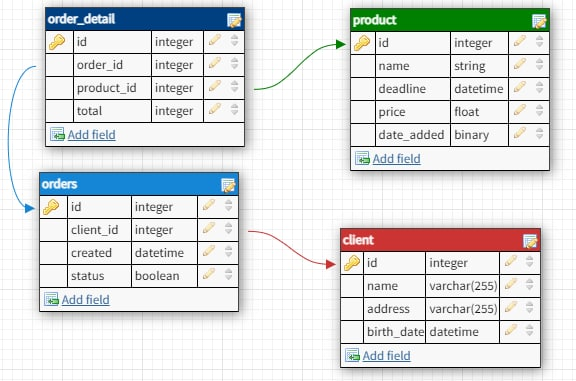
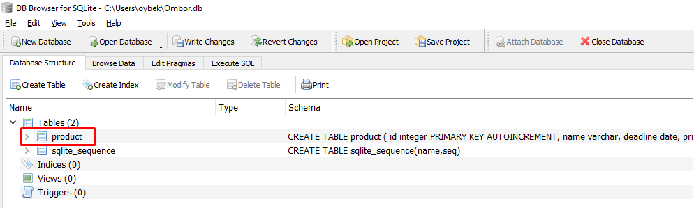
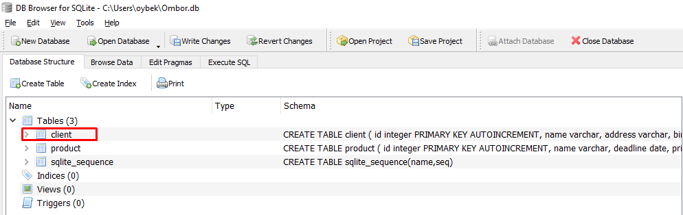
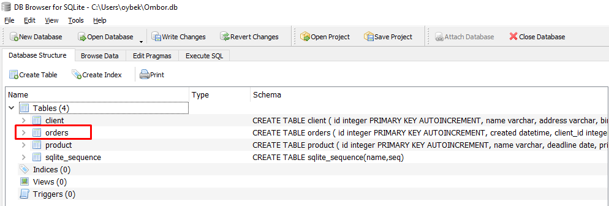
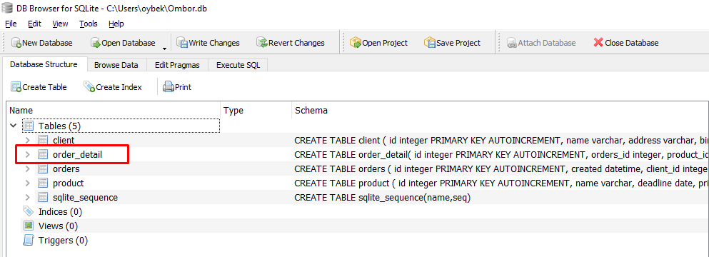
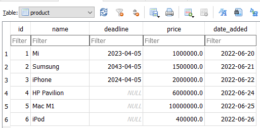
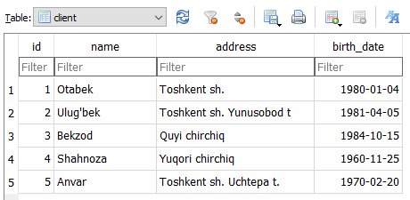
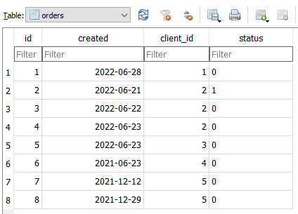
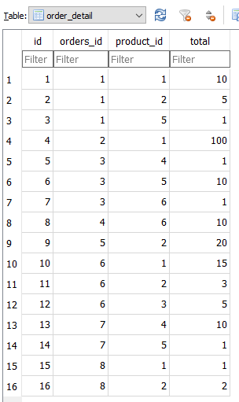

# Mavzu 7: Ombor loyihasi 1. SQL
 
## Reja:
1. [Bilim](#1-bilim)
   - [1.1 Terminlar](#11-terminlar)
   - [1.2 O'qish uchun materiallar](#12-oqish-uchun-materiallar)
2. [Amaliyot. O'qituvchi](#2-amaliyot-oqituvchi)
3. [Amaliyot. O'quvchi](#3-amaliyot-oquvchi)

## 1. Bilim

### 1.1 Terminlar
```

```
### 1.2 O'qish uchun materiallar

## 2. Amaliyot. O'qituvchi
## Reja
- [2.1 SQL. CREATE. Jadval strukturasi]()
- [2.2 SQL. INSERT. Kiritish]()
- [2.3 SQL. SELECT. O'qish]()
- [2.4 SQL. UPDATE. O'zgartirish]()
- [2.5 SQL. DELETE. O'chirish]()

### 2.1 SQL. CREATE. Jadval strukturasi
Jadval tuzish qoidasi:

```text
CREATE TABLE jadval_nomi(
   usunt1 ma'lumot_turi,
   usunt2 ma'lumot_turi,
    ...
);
```

Bizda ombor dasturining sodda sxemasi quyidagicha: <br>



<br>
Yuqorida elektron do'konning sodda ma'lumotlar bazasi strukturasidir. Biz shu struktura bo'yicha  CREATE, INSERT, SELECT, UPDATE, DELETE amallarini [avvalgi darslarda](https://github.com/Oybeklinux/Foundation_exercices/tree/main/24.%20SQLite.%20CRUD) o'rgangan edik. 
Endi shu bilimlar yordamida SQL so'rovlarni tuzib chiqamiz.
So'ngra har bir jadvalga mos class yozib chiqamiz, keyin klasslar yordamida baza bilan ishlaymiz, so'ng kivyMD da mijoz uchun dastur yasab bazaga classlarni ishlatib ulanamiz. Shu bilan CRUD (C - kiritish, R - o'qish U - o'zgartirish, D - o'chirish) amallarini bajaramiz.
<br> So'zlarni ingliz tilida yozish qulay bo'lani uchun baza strukturasi va o'zgaruvchilar nomi ingliz tilida yozildi

#### Mahsulot - product

```text
CREATE TABLE product (
    id integer PRIMARY KEY AUTOINCREMENT,
    name varchar,
    deadline date,
    price real,
    date_added date
 );
```

Jadval ustunlari nomi:
- id - mahsulotni qaytarilmasligini (boshqalardan farqli) ta'minlovchi qiymat
- name - mahsulot nomi
- deadline - mahsulot ishdan chiqish sanasi
- price - mahsulot narxi
- mahsulot bazaga kiritilgan sana


product jadvalida ishlatilgan ma'lumot turlari:
- integer - python dagi int 
- varchar - python dagi str 
- date - python dagi date
- real - python dagi float

DB Browserda ishga tushiramiz. Natijada bizda jadval tuziladi

<br>



#### Mijoz - client

```text
CREATE TABLE client (
    id integer PRIMARY KEY AUTOINCREMENT,
    name varchar,
    address varchar,
    birth_date date
);
```

Jadval ustunlari nomi:
- id - mijozni qaytarilmasligini (boshqalardan farqli) ta'minlovchi qiymat
- name - mijoz nomi
- address - mijoz yashash manzili
- birth_date - mijoz tug'ilgan sanasi (Bu ustun muhim bo'lmasada, sanalar bilan ishlash uchun kiritilgan)

product jadvalida ishlatilgan ma'lumot turlari:
- integer - python dagi int 
- varchar - python dagi str 
- date - python dagi date

DB Browserda ishga tushiramiz. Natijada ma'lumotlar bazasiga mijoz jadvali qo'shiladi

<br>



#### Buyurtma - orders

order so'zi SQL da ishlatilganligi uchun orders deb nomlandi
<br>
Mijoz mahsulot (bir yoki bir nechta) sotib olgan paytda buyurtma tuziladi. Odatda magazinda bunday qilinmaydi, lekin dasturda har bir amalni saqlab qolish uchun qachon sotib olgani va usha kunda olgan mahsulotlarni ajratish uchun buyurtma tuziladi.

```text
CREATE TABLE orders (
    id integer PRIMARY KEY AUTOINCREMENT,
    created datetime,
    client_id integer,
    status bool, -- True sotildi, False - zakaz qilingi                
    CONSTRAINT fk_client1 FOREIGN KEY (client_id) REFERENCES client (id)                
);
```

Jadval ustunlari nomi:
- id - buyutmani qaytarilmasligini (boshqalar buyurtmalardan farqlash uchun) ta'minlovchi qiymat
- created - buyurtma tuzilgan sana va vaqt
- client_id - mijoz id si, qaysi buyurtmani qaysi mijoz berganligini bilish uchun
- status - buyurtma mijoz sotildi yoki yo'qligini bildirish uchun. True - sotilganligini bildiradi, False - hali sotilmaganligini bildiradi

orders jadvalida ishlatilgan yangi ma'lumot turlari:
- datetime - python datetime. Sana va vaqtni saqlash uchun 
- bool - python dagi bool


DB Browserda ishga tushiramiz. Natijada ma'lumotlar bazasiga buyurtma jadvali qo'shiladi

<br>



#### Buyurtmaga tegishli mahsulotlar - order_detail

Mijoz bittada har hil mahsulotlar va ularning har biridan bir nechtadan olishi mumkin. Mana shu mahsulotlar va ularning soni haqida ma'lumot order_detail jadvalida bo'ladi

```text
CREATE TABLE order_detail(
	id integer PRIMARY KEY AUTOINCREMENT,
	orders_id integer,
	product_id integer,
	total integer,
	CONSTRAINT fk_product FOREIGN KEY (product_id) REFERENCES product (id),
	CONSTRAINT fk_order FOREIGN KEY (orders_id) REFERENCES orders(id)
);
```

Jadval ustunlari nomi:
- id - buyutma va unga tegishli mahsulotni qaytarilmasligini ta'minlovchi qiymat
- orders_id - qaysi buyurtmaga tegishli ekanini bilish uchun buyurtma id si yoziladi  
- product_id - qaysi mahsulot ekanini bilish uchun mahsulot id si yoziladi
- total - qaysi mahsulotdan nechta buyurtma berganligini bilish uchun mahsulotning soni
- fk_product cheklovi - product_id ustuniga o'rnatildi. Uning qiymatlari duch kelgan qiymat bo'lmaydi, faqat product jadvalining id ustunidagi qiymatlaridan biri yoki bo'sh bo'lishi mumkin. Shuning uchun foreign key cheklovini o'rnatdik. U mana shularni to'g'riligini tekshiradi.
Agar product_id ga product jadvalidagi id ustunida yo'q bo'lgan qiymat bersak, foreign key cheklovi ma'lumotni kiritishga yo'l bermydi
- fk_order_id  cheklovi - orders_id ustuniga o'rnatildi. Uning qiymatlari duch kelgan qiymat bo'lmaydi, faqat orders jadvalining id ustunidagi qiymatlaridan biri yoki bo'sh bo'lishi mumkin. Shuning uchun foreign key cheklovini o'rnatdik. U mana shularni to'g'riligini tekshiradi.
Agar orders_id ga orders jadvalidagi id ustunida yo'q bo'lgan qiymat bersak, foreign key cheklovi ma'lumotni kiritishga yo'l bermydi


DB Browserda ishga tushiramiz. Natijada ma'lumotlar bazasiga buyurtma detallari haqidagi jadval qo'shiladi

<br>



### 2.2 SQL. INSERT. Kiritish
Ma'lumot kiritish qoidasi:

```text
INSERT INTO jadval_nomi(ustun1,ustun2, ..)
VALUES(ustun1_qiymati, ustun2_qiymati,..);
```

#### Mahsulot jadvaliga ma'lumot kiritish

```text
INSERT INTO product(name, deadline,price, date_added)
VALUES('Mi', '2023-04-05', 1000000, '2022-06-20');
INSERT INTO product(name, deadline,price, date_added)
VALUES('Sumsung', '2043-04-05', 1500000, '2022-06-21');
INSERT INTO product(name, deadline,price, date_added)
VALUES('iPhone', '2024-04-05',2000000, '2022-06-22');
INSERT INTO product(name, deadline,price, date_added)
VALUES('HP Pavilion', NULL,6000000, '2022-06-24');
INSERT INTO product(name, deadline,price, date_added)
VALUES('Mac M1', NULL,10000000, '2022-06-25');
INSERT INTO product(name, deadline,price, date_added)
VALUES('iPod', NULL,400000, '2022-06-26');
```
Natija:



#### Mijoz jadvaliga ma'lumot kiritish

```text
INSERT INTO client(name, address, birth_date)
VALUES('Otabek', 'Toshkent sh.', '1980-01-04');
INSERT INTO client(name, address, birth_date)
VALUES('Ulug''bek', 'Toshkent sh. Yunusobod t', '1981-04-05');
INSERT INTO client(name, address, birth_date)
VALUES('Bekzod', 'Quyi chirchiq', '1984-10-15');
INSERT INTO client(name, address, birth_date)
VALUES('Shahnoza', 'Yuqori chirchiq', '1960-11-25');
INSERT INTO client(name, address, birth_date)
VALUES('Anvar', 'Toshkent sh. Uchtepa t.', '1970-02-20');
```

Natija:



#### Buyurtma jadvaliga ma'lumot kiritish

```text
INSERT INTO orders(created, client_id, status)
VALUES(date(), 1, 0);

-- id=2 bo'lgan mijoz, '2022-06-21' sanada buyurtma berildi va buyurtma bajarildi, ya'ni sotildi 
INSERT INTO orders(created, client_id, status)
VALUES('2022-06-21', 2, 1);
INSERT INTO orders(created, client_id, status)
VALUES('2022-06-22', 2, 0);
INSERT INTO orders(created, client_id, status)
VALUES('2022-06-23', 2, 0);
INSERT INTO orders(created, client_id, status)
VALUES('2022-06-23', 3, 0);
INSERT INTO orders(created, client_id, status)
VALUES('2021-06-23', 4, 0);
INSERT INTO orders(created, client_id, status)
VALUES('2021-12-12', 5, 0);
INSERT INTO orders(created, client_id, status)
VALUES('2021-12-29', 5, 0);
```
Izoh:
- date() - bugungu sanani qaytaradi

Natija: 



#### Buyurtma detallari jadvaliga ma'lumot kiritish

```text
-- id=1 bo'lgan mijoz id=1 bo'lgan mahsulotdan 10 ta zakaz bo'ldi 
INSERT INTO order_detail(orders_id, product_id, total)
VALUES(1, 1, 10); 
INSERT INTO order_detail(orders_id, product_id, total)
VALUES(1, 2, 5);
INSERT INTO order_detail(orders_id, product_id, total)
VALUES(1, 5, 1);
INSERT INTO order_detail(orders_id, product_id, total)
VALUES(2, 1, 100);
INSERT INTO order_detail(orders_id, product_id, total)
VALUES(3, 4, 1);
INSERT INTO order_detail(orders_id, product_id, total)
VALUES(3, 5, 10);
INSERT INTO order_detail(orders_id, product_id, total)
VALUES(3, 6, 1);
INSERT INTO order_detail(orders_id, product_id, total)
VALUES(4, 6, 10);
INSERT INTO order_detail(orders_id, product_id, total)
VALUES(5, 2, 20);
INSERT INTO order_detail(orders_id, product_id, total)
VALUES(6, 1, 15);
INSERT INTO order_detail(orders_id, product_id, total)
VALUES(6, 2, 3);
INSERT INTO order_detail(orders_id, product_id, total)
VALUES(6, 3, 5);
INSERT INTO order_detail(orders_id, product_id, total)
VALUES(7, 4, 10);
INSERT INTO order_detail(orders_id, product_id, total)
VALUES(7, 5, 1);
INSERT INTO order_detail(orders_id, product_id, total)
VALUES(8, 1, 1);
INSERT INTO order_detail(orders_id, product_id, total)
VALUES(8, 2, 2);
```

Natija:




### 2.3 SQL. SELECT. O'qish

Hamma jadvallarni ko'rish

```text
SELECT name
FROM sqlite_master
WHERE type ='table' AND name NOT LIKE 'sqlite_%';
```
Hamma mijozlarni ko'rish

```text
SELECT *
FROM client
```

Hamma mijozlarning ism va manzillarini ko'rish

```text
SELECT name, address
FROM client
```
Hamma mijozlarning ismlari bo'yicha tartiblab chiqarish

```text
SELECT *
FROM client
ORDER BY name
```

Hamma mijozlarning ismlari bo'yicha teskari tartiblab chiqarish

```text
SELECT *
FROM client
ORDER BY name DESC
```

Hamma mijozlarning tug'ilgan sana bo'yicha tartiblab chiqarish

```text
SELECT *
FROM client
ORDER BY birth_date
```

Narxi 1 mlndan qimmat bo'lgan mahsulotlarni qimmatidan arzonga qarab tartiblab chiqarish

```text
SELECT *
FROM product
WHERE price > 1000000
ORDER BY price DESC
```

Eng qimmatini chiqarish

```text
SELECT max(price), name,date_added
FROM product
```

Eng arzonini chiqarish
```text
SELECT min(price), name,date_added
FROM product
```

Narxi 500000 bilan 1 mln orasida bo'lgan mahsulotlarni chiqarish

```text
SELECT *
FROM product
WHERE price BETWEEN 500000 AND 1000000
```

2022 yil aprel oyidagi buyurtmalar

```text
SELECT strftime('%Y-%m',created),  created
FROM orders
WHERE strftime('%Y-%m',created) = '2022-06'
```

2022 yil aprel oyidagi bajarilgan buyurtmalar

```text
SELECT strftime('%Y-%m',created),  created
FROM orders
WHERE strftime('%Y-%m',created) = '2022-06'  AND status == 1
```

2022 yil aprel oyidagi bajarilmagan buyurtmalar

```text
SELECT strftime('%Y-%m',created),  created
FROM orders
WHERE strftime('%Y-%m',created) = '2022-06'  AND status == 1
```

id=1 bo'lgan buyurtmaga tegishli buyurtma detallari

```text
SELECT *
FROM order_detail
WHERE id=1
```

id=1 bo'lgan buyurtmaga tegishli mahsulotlar

```text
SELECT *
FROM order_detail o
LEFT JOIN product p ON p.id=o.product_id
WHERE o.orders_id=1
```

Izoh:
ikki jadvalni bir hil ustunlar bilan bog'lash mumkin. Bu yerda ikkala jadvalda mavjud bo'lgan ustun bu mahsulot idsi. Shuning uchun order_detail.product_id ni product.id bilan bog'ladik

```text
LEFT JOIN product p ON p.id=o.product_id
```

Ular orasidan faqat id=1 bo'lgan buyurtmanigina olsih uchun quyidagi shartni qo'shdik

```text
WHERE o.orders_id=1
```

Izoh:
o.orders_id - buyurtma id si


id=1 bo'lgan buyurtma qachon va qaysi mahsulotlar buyurtmaga berilgan

```text
SELECT d.created [Buyurtma sanasi], p.name [Mahsulot nomi], p.price[Mahsulot narxi]
FROM order_detail o
LEFT JOIN product p ON p.id=o.product_id
LEFT JOIN orders d ON d.id= o.orders_id
WHERE o.orders_id=1
```

id=1 bo'lgan buyurtma kim, qachon va qaysi mahsulotlar buyurtmaga berilgan

```text
SELECT d.created [Buyurtma sanasi], p.name [Mahsulot nomi], p.price[Mahsulot narxi], c.name
FROM order_detail o
LEFT JOIN product p ON p.id=o.product_id
LEFT JOIN orders d ON d.id= o.orders_id
LEFT JOIN client c ON c.id= d.client_id
WHERE o.orders_id=1
```

### 2.4 SQL. UPDATE. O'zgartirish

O'zgartirish qoidasi

```text
UPDATE jadval_nomi SET 
ustun1=qiymat1, ustun2=qiymat2, ...
LEFT JOIN ..
WHERE ..
```

Hamma mahsulotlarni narxini 200 000 ga oshirish

```text
UPDATE product SET price = price + 200000
```

Narxi 600000 bo'lgan mahsulotlarni narxini 700000 ga o'zgartirish

```text
UPDATE product SET price = 700000
WHERE price = 600000
```

id=3 bo'lgan mahsulot nomi, narxi, sanasini o'zgartirish

```text

```
### 2.5 SQL. DELETE. O'chirish

